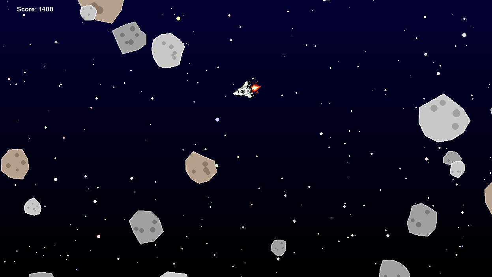

# Asteroids Game

A modern implementation of the classic Asteroids arcade game using Python and Pygame. This version features smooth controls, particle effects, and a beautiful starfield background.



## Features

- 🚀 Smooth player controls
- 🌠 Dynamic starfield background with twinkling stars and nebula effects
- 💫 Asteroid generation with surface details and craters
- 🎯 Accurate collision detection
- 📊 High score system with persistent storage
- 🎮 Classic arcade-style gameplay

## Requirements

- Python 3.8 or higher
- Pygame 2.0 or higher

## Installation

1. Clone the repository

2. Create and activate a virtual environment (recommended):

```bash
python -m venv venv
source venv/bin/activate  # On Windows, use: venv\Scripts\activate
```

3. Install dependencies:

```bash
pip install -r requirements.txt
```

## How to Play

Run the game:

```bash
python main.py
```

### Controls

- **W/↑**: Move forward
- **S/↓**: Move backward
- **A/←**: Rotate left
- **D/→**: Rotate right
- **SPACE**: Shoot
- **ESC**: Quit game

### Gameplay

- Destroy asteroids to score points
- Larger asteroids split into smaller ones when destroyed
- Avoid collisions with asteroids
- Try to achieve the highest score possible

## Project Structure

```
asteroids/
├── images/              # Game assets
│   └── rocket.png      # Player sprite
├── asteroid.py         # Asteroid class and behavior
├── asteroidfield.py    # Asteroid field management
├── background.py       # Starfield and nebula effects
├── circleshape.py      # Base circle shape class
├── constants.py        # Game constants and settings
├── main.py            # Main game loop
├── player.py          # Player class and controls
├── score.py           # Score management
├── shape.py           # Base shape class
├── shot.py            # Projectile class
├── star.py            # Star class for background
├── triangleshape.py   # Triangle shape class
└── requirements.txt   # Project dependencies
```

## Development

### Debug Mode

Run the game in debug mode to visualize collision boxes and other debug information:

```bash
python main.py --debug
```

### Code Style

The project follows Python type hints and PEP 8 style guidelines. All classes and methods are properly typed for better code maintainability and IDE support.

## License

This project is licensed under the MIT License

## Acknowledgments

- Inspired by the original Asteroids arcade game
- Project completed as part of [boot.dev](https://www.boot.dev/tracks/backend) backend dev course
- Built with Python and Pygame
- Starfield background inspired by classic space games
